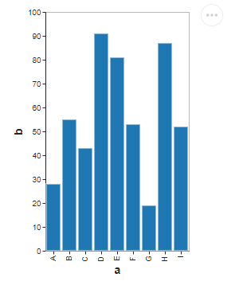
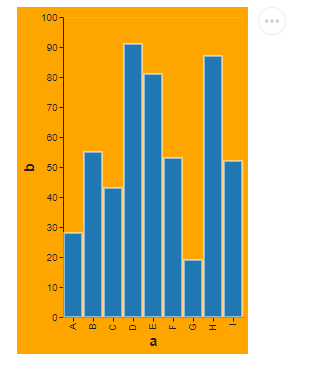

# User Guide

## Enabling a theme

Enabling the themes that come with this library is as easy to just enable them with altair, then you can create
your chart as you want the available themes in this library are:

- accessible_theme
- dark_accessible_theme
- filler_pattern_theme
- print_theme

```py
import altair as alt
import pandas as pd

alt.themes.enable('accessible_theme')

source = pd.DataFrame({
    'a': ['A', 'B', 'C', 'D', 'E', 'F', 'G', 'H', 'I'],
    'b': [28, 55, 43, 91, 81, 53, 19, 87, 52]
})

alt.Chart(source).mark_bar().encode(
    x='a',
    y='b'
)
```



## Customizing a built-in theme

Each theme comes from the **ModelTheme** defined in this library [API](p2-api.md), so you only need to instance the
model
and call to the
functions defined to make little customizations to the theme, then enable the theme, like this where we change the
background color to orange:

### Changing background color

```python
import altair as alt

# Changing background color of the accessible_theme
accesible_theme = AccessibleTheme()
accesible_theme.change_background_color('orange')

alt.themes.enable('accessible_theme')

source = pd.DataFrame({
    'a': ['A', 'B', 'C', 'D', 'E', 'F', 'G', 'H', 'I'],
    'b': [28, 55, 43, 91, 81, 53, 19, 87, 52]
})

alt.Chart(source).mark_bar().encode(
    x='a',
    y='b'
)

```



### Changing mark color

This changes the bar, line, path,points,rect,ruel,shape marks.This example change the color of the marks to purple

```python
import altair as alt
import pandas as pd
from altair_easeviz.models import AccessibleTheme

accessible_theme = AccessibleTheme()
accessible_theme.change_mark_color('purple')

alt.themes.enable('accessible_theme')

source = pd.DataFrame({
    'a': ['A', 'B', 'C', 'D', 'E', 'F', 'G', 'H', 'I'],
    'b': [28, 55, 43, 91, 81, 53, 19, 87, 52]
})

chart = alt.Chart(source).mark_bar().encode(
    x='a',
    y='b'
)
```


### Changing text color

Change the color of the title, legend, axis, texts. This example change the text color to purple

```python
import altair as alt
import pandas as pd
from altair_easeviz.models import AccessibleTheme

accessible_theme = AccessibleTheme()
accessible_theme.change_text_color('purple')

alt.themes.enable('accessible_theme')

source = pd.DataFrame({
    'a': ['A', 'B', 'C', 'D', 'E', 'F', 'G', 'H', 'I'],
    'b': [28, 55, 43, 91, 81, 53, 19, 87, 52]
})

chart = alt.Chart(source).mark_bar().encode(
    x='a',
    y='b'
)
```


### Changing line color

Change the color of axis ticks and grid lines. This example changes the line colors to red and shows the grid

```python
import altair as alt
import pandas as pd
from altair_easeviz.models import AccessibleTheme

accessible_theme = AccessibleTheme()
accessible_theme.change_grid_show()
accessible_theme.change_color_line('red')

alt.themes.enable('accessible_theme')

source = pd.DataFrame({
    'a': ['A', 'B', 'C', 'D', 'E', 'F', 'G', 'H', 'I'],
    'b': [28, 55, 43, 91, 81, 53, 19, 87, 52]
})

chart = alt.Chart(source).mark_bar().encode(
    x='a',
    y='b'
)
```


### Increasing font size

Increase by a number all the font sizes used

```python
import altair as alt
import pandas as pd
from altair_easeviz.models import AccessibleTheme

accessible_theme = AccessibleTheme()
accessible_theme.increase_font_size(20)

alt.themes.enable('accessible_theme')

source = pd.DataFrame({
    'a': ['A', 'B', 'C', 'D', 'E', 'F', 'G', 'H', 'I'],
    'b': [28, 55, 43, 91, 81, 53, 19, 87, 52]
})

chart = alt.Chart(source).mark_bar().encode(
    x='a',
    y='b'
)
```


### Decreasing font size

Decrease by a given number all the font sizes used until reached zero, if reaches zero the text is no longer visible

```python
import altair as alt
import pandas as pd
from altair_easeviz.models import AccessibleTheme

accessible_theme = AccessibleTheme()
accessible_theme.decrease_font_size(20)

alt.themes.enable('accessible_theme')

source = pd.DataFrame({
    'a': ['A', 'B', 'C', 'D', 'E', 'F', 'G', 'H', 'I'],
    'b': [28, 55, 43, 91, 81, 53, 19, 87, 52]
})

chart = alt.Chart(source).mark_bar().encode(
    x='a',
    y='b'
)
```


### Change categorical color schemes

Change the default scale of all charts that uses a color parameter when encoding the chart and are shown by category

If you [set a scale](https://altair-viz.github.io/user_guide/customization.html#customizing-colors) like in Altair this
scale has priority over this default color scheme

```python
import altair as alt
import pandas as pd

from altair_easeviz.models import AccessibleTheme

accessible_theme = AccessibleTheme()
accessible_theme.change_categorical_scheme(['red', 'yellow', 'green'])

alt.themes.enable('accessible_theme')

source = pd.DataFrame({
    "Category": list("AAABBBCCC"),
    "Group": list("xyzxyzxyz"),
    "Value": [0.1, 0.6, 0.9, 0.7, 0.2, 1.1, 0.6, 0.1, 0.2]
})

chart = alt.Chart(source).mark_bar().encode(
    x="Category:N",
    y="Value:Q",
    xOffset="Group:N",
    color="Group:N"
)
```


### Change sequential color schemes

Change the default scale of all charts that uses a color parameter when encoding the chart are shown by sequence

If you [set a scale](https://altair-viz.github.io/user_guide/customization.html#customizing-colors) like in Altair this
scale has priority over this default color scheme

```python
import altair as alt
from altair_easeviz.models import AccessibleTheme
from vega_datasets import data

accessible_theme = AccessibleTheme()
accessible_theme.change_sequential_scheme(['green', '#008000', '#00f200', '#00ff21', '#00ff64'])

alt.themes.enable('accessible_theme')

cars = data.cars()

chart = alt.Chart(cars).mark_point().encode(
    x='Horsepower',
    y='Miles_per_Gallon',
    color=alt.Color('Acceleration')
)
```


## Creating a new theme

### Vega-altair way of defining a theme

Creating a new theme is a built-in function in vega-altair all that is need it is a funtion that return a dict object
with the appropriate keys and values defined in vega-lite, then register the theme and finally enabling it

```python
import altair as alt
from vega_datasets import data


# define the theme by returning the dictionary of configurations
def black_marks():
    return {
        'config': {
            'view': {
                'height': 300,
                'width': 300,
            },
            'mark': {
                'color': 'black',
                'fill': 'black'
            }
        }
    }


# register the custom theme under a chosen name
alt.themes.register('black_marks', black_marks)

# enable the newly registered theme
alt.themes.enable('black_marks')

# draw the chart
cars = data.cars.url
alt.Chart(cars).mark_point().encode(
    x='Horsepower:Q',
    y='Miles_per_Gallon:Q'
)
```


### Acceessilbe-theme way of defining a theme

However, in this library we use a more direct and organized method, in this library there are several models defined
that correspond to what the vega-lite API expects.
A simple example would be like this

```python
import altair as alt
from vega_datasets import data

# Create new dictionary with the configurations for the axis
axis_config = AxisModel(labelColor='#e7212f', titleColor='#e7212f').create_axis()

# Create a new dictionary of configurations
red_text_axis = ConfigModel(axis=axis_config).create_config()


# Define the theme by return the dictionary with the configurations
def red_axis_theme():
    return red_text_axis


# register the custom theme under a chosen name
alt.themes.register('red_axis_theme', red_axis_theme)

# enable the newly registered theme
alt.themes.enable('red_axis_theme')

# draw the chart
cars = data.cars.url
alt.Chart(cars).mark_point().encode(
    x='Horsepower:Q',
    y='Miles_per_Gallon:Q'
)

```


You can also just use the ModelTheme for a quicker and simpler theme.
In this example, we create a theme with purple dots and black background

```python
import altair as alt
from altair_easeviz.models import ModelTheme
from vega_datasets import data

# Create theme (name_theme, text_color, axis_color, mark_color, background_color, show_grid)
purple_theme = ModelTheme('purple_theme', 'white', 'purple', 'purple', 'black', True)

# Register and enable theme
alt.themes.register(purple_theme.getName(), purple_theme.get_theme)
alt.themes.enable(purple_theme.getName())

# draw the chart
cars = data.cars.url
chart = alt.Chart(cars).mark_point().encode(
    x='Horsepower:Q',
    y='Miles_per_Gallon:Q'
)
```


Check the [API](p2-api.md) page for more information about the available models

## Creating an accessible chart for the user

The library comes with a function called create_accessible_scheme() that uses jinja2 and a custom template where it is
expected the chart to render.

This function will use the chart to create a new HTML with options for the user to custom the graph such as

- Changing the categorical default color scheme, but does not change the sequential schemes like in a heatmap
- Increase/Decrease the font size
- Adjust the height and width
- Show chart description on screen and add it in aria label if a description is given

It has a limitation since it does not fully
support[ compound charts](https://altair-viz.github.io/user_guide/compound_charts.html)

```python
import altair as alt
import pandas as pd
from altair_easeviz import create_accessible_scheme

source = pd.DataFrame({
    "Category": list("AAABBBCCC"),
    "Group": list("xyzxyzxyz"),
    "Value": [0.1, 0.6, 0.9, 0.7, 0.2, 1.1, 0.6, 0.1, 0.2]
})

base = alt.Chart(source).mark_bar().encode(
    x="Category:N",
    y="Value:Q",
    xOffset="Group:N",
    color="Group:N"
)
# Creates a HTML named bar-chart.HTML
create_accessible_scheme(base, 'bar-chart',
                         'This is bar chart description written by hand, here you can describe details of the chart for screen readers or people low vision')
```


### Using Filler Pattern

Filler patterns is a god way to help people with vision problems, we can use this feature with our
create_accessible_scheme() function since the template that uses is charge with various color patterns at our disposal
we only need to set them as our categorical color sheme.
We use object to are related to the color in some of our color patterns since is a god way to help undertand what color
is looking

Here is an example where we change the color scheme categorical of one of our themes, the theme filler_pattern_theme has
these loaded by default

```python
import altair as alt
import pandas as pd
from altair_easeviz import create_accessible_scheme
from altair_easeviz.models import AccessibleTheme


accessible_theme = AccessibleTheme()
accessible_theme.change_categorical_scheme(
    ["url(#red-heart)", "url(#blue-rain)", "url(#green-leaf)", "url(#purple-grapes)", "url(#orange-orange)",
     "url(#yellow-star)", "url(#brown-chocolate)", "url(#pink-donut)", "url(#grey-wrench)"])

alt.themes.enable('accessible_theme')

source = pd.DataFrame({
    "Category": list("AAABBBCCC"),
    "Group": list("xyzxyzxyz"),
    "Value": [0.1, 0.6, 0.9, 0.7, 0.2, 1.1, 0.6, 0.1, 0.2]
})

chart = alt.Chart(source).mark_bar().encode(
    x="Category:N",
    y="Value:Q",
    xOffset="Group:N",
    color="Group:N"
)
create_accessible_scheme(chart,'patterns')
```


You can all the patterns avaible in the [API](p2-api.md)

## Generate description of a graph

The function generate_description() creates a description for a given chart, this is thanks to the
library [BrailleR](https://cran.r-project.org/web/packages/BrailleR/index.html).
But in order to be able to use this function is necessary to understand its requirements and limitations

The most important requirement is to have R running in the background were we must have installed the next libraries

- Rserve, this is the key library we use as a bridge between Python and R
- ggplot2, we use this to recreate the chart of Altair
- BrailleR, this is the core library that creates the descriptions of the chart
- thematic is customatization library for ggplot2 similar to ours uses some of the same schemes we use

After you have all the libraries installed, the last step is to run
`        library(Rserve)
Rserve()`

About the limitations of this function, that would be the number of charts available to run and the complexity of these.
As the current version we only count with these:

- barchart
- linechart
- scatterplot
- piechart

Here is an example:

```python
import altair as alt
import pandas as pd
from altair_easeviz import create_accessible_scheme, generate_description

source = pd.DataFrame({
    'a': ['A', 'B', 'C', 'D', 'E', 'F', 'G', 'H', 'I'],
    'b': [28, 55, 43, 91, 81, 53, 19, 87, 52]
})

base = alt.Chart(source).mark_bar().encode(
    x='a',
    y='b'
)
# Generate description of the chart
description = generate_description(base, 'barchart', source['a'].tolist(), source['b'].tolist())
# The functions return a dict with the key 'error' if any exceptions were throw and 'res' with the generated description
description = description['res'] if 'res' in description else description['error']

# We render the description in an HTML 
create_accessible_scheme(base, 'proba', description)

```


[ThemeModel]:p2-api.md