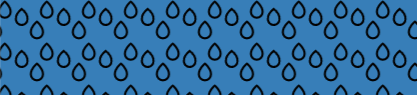
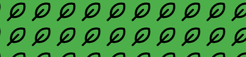
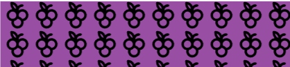
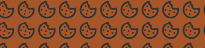
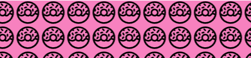
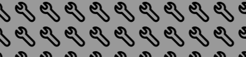
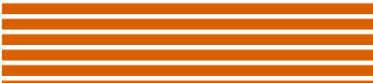
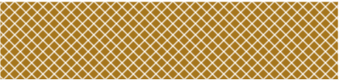
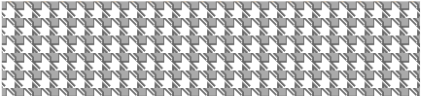

# Api

Within this page, you will discover comprehensive specifications and intricacies regarding the models utilized and
the functions created. It is advisable, however, to reference the "[Getting Started]" and "[Examples]" sections for a
more
streamlined comprehension of the library. These sections provide practical insights and usage scenarios that can
significantly enhance your understanding of the library's functionality and facilitate a smoother initiation process.

## Models

| Model         | Description                                                                                                                          |
|---------------|--------------------------------------------------------------------------------------------------------------------------------------|
| [ModelTheme]  | This models contains a Config model, some basic variables of color and functions to change the theme.                                |
| [ConfigModel] | A model with the main purpose is to hold and create a dict to hold all vega-lite specification, uses other models to be constructed. |
| [AxisModel]   | Model that contains some of the parameters of the 'axis' in  vega-lite specification                                                 |
| [HeaderModel] | Model that contains some of the parameters of the 'header' in  vega-lite specification                                               |
| [LegendModel] | Model that contains some of the parameters of the 'legend' in  vega-lite specification                                               |
| [MarkModel]   | Model that contains some of the parameters of the 'axis' in  vega-lite specification                                                 |
| [RangeModel]  | Model that contains 'category','diverging', 'heatmap' and 'ramp' parameters of the 'range' in  vega-lite specification               |
| [TitleModel]  | Model that contains some of the parameters of the 'title' in  vega-lite specification                                                |
| [ViewModel]   | Model that contains some of the parameters of the 'view' in  vega-lite specification                                                 |

### ModelTheme

`class altair_easeviz.models.ModelTheme(name_theme: str, text_color: str, axis_color: str, mark_color:
str,background_color: str, grid: bool)`

This model helps to create easy new themes for Altair, it is with this model that we create the 4 themes we included.

**Parameters:**

**name_theme** : str

The name that be registered in the altair.themes

**text_color** : str, HexColor,[ColorName]

Define the color of all the text of the chart included the mark Text

**axis_color**:  str, HexColor,[ColorName]

Define the color of the grid, axis and mark Lines of the chart

**mark_color**: str, HexColor,[ColorName]

Define the color of all marks in the chart

**background_color**:str, HexColor,[ColorName]

Define the color of the background of the chart

**grid**: bool

Define if the chart will show its grid or not

**colors**: Colors, dict

A dict that holds all the colors used in the model
arc,axis,background,text,mark,scheme{categorical,diverging,sequential}

**font_size**: dict

Holds the three sizes we use in the graph, is used to give a hierarchy order size to the text

**spacing**: dict

Holds the three sizes we use in the graph for spacing

**config**: dict

Creates a ConfigModel and holds dict with all the configurations described below following the vega-lite specification

**axis_config**: Axis, dict

Create and holds dict of type Axis describe it in types

**header_config**: Header, dict

Create and hold dict of type Header describe it in types

**legend_config**: Legend, dict

Create and holds dict of type Legend describe it in types

**title_config**: Title, dict

Create and hold dict of type Title describe it in types

**view_config**: View, dict

Create and hold dict of type View describe it in types

**range_config**: ScaleRange, dict

Create and hold dict of type ScaleRange describe it in types

**arc_config**: Mark, dict

Create and holds dict of type Mark describe it in types

**bar_config**: Mark, dict

Create and hold dict of type Mark describe it in types

**line_config**: Mark, dict

Create and hold dict of type Mark describe it in types

**path_config**: Mark, dict

Create and hold dict of type Mark describe it in types

**point_config**: Mark, dict

Create and hold dict of type Mark describe it in types

**rect_config**: Mark, dict

Create and hold dict of type Mark describe it in types

**rule_config**: Mark, dict

Create and hold dict of type Mark describe it in types

**shape_config**: Mark, dict

Create and hold dict of type Mark describe it in types

**text_config**: Mark, dict

Create and hold dict of type Mark describe it in types

**Functions:**

| Function                                    | Description                                                                                                               |
|---------------------------------------------|---------------------------------------------------------------------------------------------------------------------------|
| get_theme()                                 | It returns a dict with all the config like the parameter config in the vega-lite specification                            |
| get_name()                                  | Return the name of the theme                                                                                              |
| change_background_color()                   | Change the background color and re register the theme in altair with the same name_theme                                  |
| change_mark_color()                         | Change the mark color and re register the theme in altair with the same name_theme                                        |
| change_text_color()                         | Change the text color and re register the theme in altair with the same name_theme                                        |
| increase_font_size(number:int)              | Increases all values in font_size by the number given  and re register the theme in altair with the same name_theme       |
| decrease_font_size(number:int)              | Decreases all values in font_size by the number given  and re register the theme in altair with the same name_theme       |
| change_categorical_scheme(scheme:List[str]) | Replaces the list in colors['categorical'] by the given scheme  and re register the theme in altair                       |
| change_sequential_scheme(scheme:List[str])  | Replaces the list in colors['sequential'] by the given scheme  and re register the theme in altair                        |
| change_color_line(color_line)               | Replaces the value in colors['axis'] that define the color of the grid and axis lines and re register the theme in altair |
| change_grid_show()                          | Switch beetwen tru or false if the grid is show                                                                           |

### ConfigModel

`class altair_easeviz.models.ConfigModel(**kwargs)`

The configuration model, resembling other models outlining the vega-lite specification, utilizes keyword arguments (
kwargs) to accommodate an arbitrary number of parameters, should the need arise. However, in consideration of the Config
type and the presumption that developers may not explicitly define each parameter, the model inherently incorporates a
predetermined set of default parameters.

**Parameters:**

_**required_params**: dict

A dict that holds in keys the variables we use in this model and in the value holds the type that uses the variable this
was meant to check if the kwargs passed were equal.

**axis** : dict

A dict that holds keys and values of the axis parameter valids in the vega-lite specification

**legend** : dict

A dict that holds keys and values of the legend parameter valids in the vega-lite specification

**range** : dict

A dict that holds keys and values of the range parameter valids in the vega-lite specification

**background** : str

A string that holds the value of the background of the chart

**header** : dict

A dict that holds keys and values of the header parameter valids in the vega-lite specification

**title** : dict

A dict that holds keys and values of the title parameter valids in the vega-lite specification

**view** : dict

A dict that holds keys and values of the view parameter valids in the vega-lite specification

**Functions:**

| Function             | Description                                                                                                        |
|----------------------|--------------------------------------------------------------------------------------------------------------------|
| create_config()      | A function that uses all the parameters describe in _required_params and creates a Config type(dict) and return it |
| create_full_config() | A function that uses all the parameters passed i the kwargs and creates a Config type(dict) and return it          |
| __str__()            | It return a string of the function create_full_config()                                                            |

### AxisModel

`class altair_easeviz.models.AxisModel(**kwargs)`

A model to hold all related axis parameters

**Parameters:**

_**required_params**: dict

A dict that holds in keys the variables we use in this model and in the value holds the type that uses the variable this
was meant to check if the kwargs passed were equal.

**domain** : bool

A boolean flag indicating if the domain (the axis baseline) should be included as part of the axis.

**domain**: str, ColorName, HexColor

Color of axis domain line.

**domainColor** : str, HexColor,[ColorName]

Color of axis domain line.

**grid**: bool

A boolean flag indicating if grid lines should be included as part of the axis

**gridCap**: str

The stroke cap for grid lines’ ending style. One of "butt", "round" or "square".

**gridColor** : str, HexColor,[ColorName]

Color of gridlines.

**gridDash**:[[condition, value]]

An array of alternating [stroke, space] lengths for dashed grid lines.

**gridWidth**:float

The grid width, in pixels.

**labelColor** :str, HexColor,[ColorName]

The color of the tick label can be in hex color code or regular color name.

**labelFont**:str

The font of the tick label.

**labelFontSize**:int

The font size of the tick labels.

**labelPadding**:float

The padding in pixels between labels and ticks.

**tickColor** :str, HexColor,[ColorName]

The color of the axis’s tick.

**tickOpacity**:float
Opacity of the ticks.
**ticks**:bool
Boolean value that determines whether the axis should include ticks.
**tickSize**:int
The size in pixels of axis ticks.
**titleColor** :str, HexColor,[ColorName]
Color of the title, can be in hex color code or regular color name.
**titleFont**:str
Font of the title. (e.g., "Helvetica Neue" ).
**titleFontSize**:int
Font size of the title.

**Functions:**

| Function      | Description                                                                                                       |
|---------------|-------------------------------------------------------------------------------------------------------------------|
| create_axis() | A function that uses all the parameters describe in _required_params and creates a Axis type(dict) and returns it |

### HeaderModel

`class altair_easeviz.models.HeaderModel(**kwargs)`

A model to hold all related header parameters

**Parameters:**

_**required_params**: dict

A dict that holds in keys the variables we use in this model and in the value holds the type that uses the variable this
was meant to check if the kwargs passed were equal.

**labelColor**: str, HexColor,[ColorName]

The color of the header label can be in hex color code or regular color name.

**labelFont**: str

The font of the header label.

**labelFontSize**: int

The font size of the header label, in pixels.

**titleColor**: str, HexColor,[ColorName]

Color of the header title can be in hex color code or regular color name.

**titleFont**: str
Font of the header title. (e.g., "Helvetica Neue" ).

**titleFontSize**: int

The font style of the header title.

**Functions:**

| Function        | Description                                                                                                         |
|-----------------|---------------------------------------------------------------------------------------------------------------------|
| create_header() | A function that uses all the parameters describe in _required_params and creates a Header type(dict) and returns it |

### LegendModel

`class altair_easeviz.models.HeaderModel(**kwargs)`

A model to hold all related header parameters

**Parameters:**

_**required_params**: dict

A dict that holds in keys the variables we use in this model and in the value holds the type that uses the variable this
was meant to check if the kwargs passed were equal.

**labelColor**: str, HexColor,[ColorName]

The color of the legend label, can be in hex color code or regular color name.

**labelFont**: str

The font of the legend label.

**labelFontSize**: int

The font size of legend label.

**symbolSize**: int

The size of the legend symbol, in pixels.

**titleColor**: str, HexColor,[ColorName]

The color of the legend title, can be in hex color code or regular color name.

**titleFont**: str

The font of the legend title.

**titleFontSize**: int

The font size of the legend title.

**titlePadding**: int

The padding, in pixels, between title and legend.

**Functions:**

| Function        | Description                                                                                                         |
|-----------------|---------------------------------------------------------------------------------------------------------------------|
| create_legend() | A function that uses all the parameters describe in _required_params and creates a Legend type(dict) and returns it |

### MarkModel

    class altair_easeviz.models.MarkArkModel(**kwargs)
    class altair_easeviz.models.MarkBarModel(**kwargs)
    class altair_easeviz.models.MarkLineModel(**kwargs)
    class altair_easeviz.models.MarkLineModel(**kwargs)
    class altair_easeviz.models.MarkPathModel(**kwargs)
    class altair_easeviz.models.MarkPointModel(**kwargs)
    class altair_easeviz.models.MarkRectModel(**kwargs)
    class altair_easeviz.models.MarkRuleModel(**kwargs)
    class altair_easeviz.models.MarkShapeModel(**kwargs)
    class altair_easeviz.models.MarkTextModel(**kwargs)

A model to hold all related mark parameters. Unlike other models the mark related models hold similar variables and all
are the

**Parameters:**

_**required_params**: dict

A dict that holds in keys the variables we use in this model and in the value holds the type that uses the variable this
was meant to check if the kwargs passed were equal.

**color**: str, HexColor,[ColorName]

Default color. The fill and stroke properties have higher precedence than color and will override color.

**fill**: str, HexColor,[ColorName]

Default fill color.

**filled**: bool

Whether the mark’s color should be used as fill color instead of stroke color.

**font**: str

The typeface to set the text in (e.g., "Helvetica Neue" ).

**fontSize**: int

The font size, in pixels.

**shape**: str

Shape of the point marks. Supported values include:

- plotting shapes: "circle", "square", "cross", "diamond", "triangle-up", "triangle-down", "triangle-right", or "
  triangle-left".

- the line symbol "stroke"

- centered directional shapes "arrow", "wedge", or "triangle"

- a custom SVG path string (For correct sizing, custom shape paths should be defined within a square bounding box with
  coordinates ranging from -1 to 1 along both the x and y dimensions.)

**stroke**: str, HexColor,[ColorName]

Default stroke color.

**strokeWidth**: float

The stroke width, in pixels.

**Functions:**

The function name varies in each model but follows a similar pattern. For example fot the MarkBarModel the function
would be create_mark_bar().

| Function           | Description                                                                                                        |
|--------------------|--------------------------------------------------------------------------------------------------------------------|
| create_name_mark() | A function that uses all the parameters describe in _required_params and creates a Mark type( dict) and returns it |

### RangeModel

`class altair_easeviz.models.RangeModel(**kwargs)`

A model to hold all related header parameters

**Parameters:**

**category**: List(str, HexColor, [ColorName])

Default color scheme for categorical data.

**diverging**: List(str, HexColor, [ColorName])

Default color scheme for diverging quantitative ramps.

**heatmap**: List(str, HexColor, [ColorName])

Default color scheme for quantitative heatmaps.

**ramp**: List(str, HexColor, [ColorName])

Default color scheme for sequential quantitative ramps.

**Functions:**

| Function       | Description                                                                                                        |
|----------------|--------------------------------------------------------------------------------------------------------------------|
| create_range() | A function that uses all the parameters describe in _required_params and creates a Range type(dict) and returns it |

### TitleModel

`class altair_easeviz.models.TitleModel(**kwargs)`

A model to hold all related title parameters

**Parameters:**

_**required_params**: dict

A dict that holds in keys the variables we use in this model and in the value holds the type that uses the variable this
was meant to check if the kwargs passed were equal.

**anchor**: str

The anchor position for placing the title and subtitle text. One of "start", "middle", or "end". For example, with an
orientation of top these anchor positions map to a left-, center-, or right-aligned title.
Default "star"

**color**: str, HexColor, [ColorName]

Text color for title text.

**font**: str

Font name for title text.

**fontSize**: int

Font style for title text.

**fontWeight**: str, ‘normal’, ‘bold’, ‘lighter’, ‘bolder’, 100, 200, 300, 400, 500, 600, 700, 800, 900

Font weight for title text. This can be either a string (e.g "bold", "normal" ) or a number ( 100, 200, 300, …, 900
where "normal" = 400 and "bold" = 700 ).

**offset**: int

The orthogonal offset in pixels by which to displace the title group from its position along the edge of the chart.

**subtitleColor**: str, HexColor, [ColorName]

Text color for subtitle text.

**subtitleFontSize**: int

Font size in pixels for subtitle text.

**Functions:**

| Function       | Description                                                                                                        |
|----------------|--------------------------------------------------------------------------------------------------------------------|
| create_title() | A function that uses all the parameters describe in _required_params and creates a Title type(dict) and returns it |

### ViewModel

`class altair_easeviz.models.ViewModel(**kwargs)`

A model to hold all related view parameters

**Parameters:**

_**required_params**: dict

A dict that holds in keys the variables we use in this model and in the value holds the type that uses the variable this
was meant to check if the kwargs passed were equal.

**continuousHeight**: int

The default height when the plot has a continuous y-field for x or latitude, or has arc marks. Default value: 300

**continuousWidth**: int

The default width when the plot has a continuous field for x or longitude, or has arc marks.
Default value: 400

**stroke**: str, HexColor, [ColorName]
The stroke color.Defalut value: transparent

**Functions:**

| Function      | Description                                                                                                       |
|---------------|-------------------------------------------------------------------------------------------------------------------|
| create_view() | A function that uses all the parameters describe in _required_params and creates a View type(dict) and returns it |

## Themes

The themes provided in this library are based in the model ModelTheme where the only variations are the color used. The
color schemes were inspired by the [Color Brewer] project and also check in [WAIM] contrast, so it follows the
regulations of the WCAG2.0

### accessible_theme

The theme uses a white background with dark text and axis, the palette of colors consists of colors that vary its hue,
so it can be distinguished

```python
class AccessibleTheme(ModelTheme):
    def __init__(self):
        super().__init__('accessible_theme', COLOR_PRIMITIVES["black"], COLOR_PRIMITIVES["black"],
                         COLOR_PRIMITIVES["blue"]['30'], COLOR_PRIMITIVES["white"], False)
```

### dark_accessible_theme

The theme uses a dark background with white text and axis enhancing that a light version the palette of colors uses a
variation in illumination, so it can be distinguished

```python
class DarkAccessibleTheme(ModelTheme):
    def __init__(self):
        super().__init__('dark_accessible_theme', COLOR_PRIMITIVES["white"], COLOR_PRIMITIVES["white"],
                         COLOR_PRIMITIVES["blue"]['30'], COLOR_PRIMITIVES["black"], False)
        self.change_categorical_scheme(COLORS["schemes"]['categorical']['paired'])

    def change_categorical_scheme(self, scheme: List[str]):
        super().change_categorical_scheme(scheme)
```

### filler_pattern_theme

This theme uses a white background and dark text and axis, its particularity comes in is color palette, the color
palette follows the same reason of changing its hue but also adds a filler pattern, so the marks can be more visible
between themselves
This is possible to do only with our [create_accessible_scheme()] function since it preloads svg in the HTML to be used

```python
class FillerPatternTheme(ModelTheme):
    def __init__(self):
        super().__init__('filler_pattern_theme', COLOR_PRIMITIVES["black"], COLOR_PRIMITIVES["black"],
                         COLOR_PRIMITIVES["blue"]['30'], COLOR_PRIMITIVES["white"], False)
        self.change_categorical_scheme(
            ["url(#red-heart)", "url(#blue-rain)", "url(#green-leaf)", "url(#purple-grapes)", "url(#orange-orange)",
             "url(#yellow-star)", "url(#brown-chocolate)", "url(#pink-donut)", "url(#grey-wrench)", ])

    def change_categorical_scheme(self, scheme: List[str]):
        super().change_categorical_scheme(scheme)
```

### print_friendly_theme

The theme is meant to work if the graph ever is printed and photocopied on a gray scale. Does not follow the WCAG2.0
regulations

```python
class PrintFriendlyTheme(ModelTheme):
    def __init__(self):
        super().__init__('print_theme', COLOR_PRIMITIVES["black"], COLOR_PRIMITIVES["black"],
                         COLOR_PRIMITIVES["blue"]['30'], COLOR_PRIMITIVES["white"], False)
        self.change_categorical_scheme(COLORS["schemes"]['categorical']['set3'])

    def change_categorical_scheme(self, scheme: List[str]):
        super().change_categorical_scheme(scheme)
```

## Top-Level Functions

Our library beside the themes and models offers two functions that can come handy to make accessible chart faster

### create_accesible_scheme()

This function works similar like the altair.Chart.save() function but offers more options for the user in the HTML being
able to change the color palette, increase/decrese the font size and size of the chart. Also, will show a description if
given in HTML
All this function also work with keyboard navigation so can be used for more people

```python
def create_accessible_scheme(chart: Chart, filename: str = 'test', description: str = None):

```

**Parameters**:

**chart** : altair.Chart

Any Chart object of Altair works to be rendered, but not all Charts can used the functions described in the HTML these
include LayerChart, HConcatChart, VConcatChart, FacetChart, RepeatChart

**filename**: str

The name of the HTML to create

**description**: str

A description for the chart given, if given it will be included in the aria-label of the chart and shown in the HTML in
a div

### generate_description()

This function can generate a description for a given chart, it's powered by BrailleR, so it has prerequisite to be used
and that is to have R installed with the appropriate libraries
It works recreating the chart in R, so it can only use simple charts

```python
def generate_description(chart: Chart, type_chart: str, axis_x: List, axis_y: List):

```

**Parameters**:

**chart** : altair.Chart

Any Chart object of Altair works to be used

**type_chart** : str, ['barchart','scatterplot', 'linechart','piechart']

Define the type of Chart to be sent to R

**axis_x** : List

A list that contains the values of the X axis can be either str, int or float

**axis_y** : List

A list that contains the values of the X axis can be either str, int or float

**Return**:

It returns a dict object with either of the next keys:

- 'res' It contains a string with a description of the chart
- 'error' It contains the description of the exception that occurred

## Color schemes

### Color palettes

The following are the available color palettes in tokens these can be found in color brewer

- dark2


- paired


- set1


- set3


### Color patterns

When using our function create_accesible_scheme() you can use any of the next patterns with the ID:

This first batch of a pattern follows the technique of associatiing a color to an object, we choose the most simple
color
palette that contains the basic colors

- red-heart


- blue-rain



- green-leaf



- purple-grapes



- orange-orange


- yellow-star


- brown-chocolate



- pink-donut



- grey-wrench

This next batch contains different patterns not following any logic, these were provided by the Irine
Rios [patterns fills project](https://iros.github.io/patternfills/) and the color scheme behind is the same used in the
accessible theme



- teal-vertical


- orange-horizontal



- purple-diagonal-rl


- pink-diagonal-lr


- green-dots-inv


- yellow-circles


- brown-cross



- grey-houndstooth



## Tokens

The tokens python files contains resources of colors, font sizes, spacing sizes, color palettes, etc.

A good example would be to import a color palette and use it in a chart

```python
from altair_easeviz.tokens import COLORS

color_palette = COLORS['schemes']['categorical']['ibm']  # Return a list of colors in HEX
```

## Types

[Typing](https://docs.python.org/3/library/typing.html) in python was used to ensure and give hints in future
developments of what to expect in a variable a good example would be that we used this to highlight how a parameter in a
vega-lite specification should have, does not affect the compiling process but helps to develop , the next is an example
of what should have a Config type

```python
class Config(TypedDict, total=False):
    """Chart theme configuration."""

    axis: Axis
    axisBand: Axis
    axisY: Axis
    legend: Legend
    arc: Mark
    bar: Mark
    line: Mark
    path: Mark
    point: Mark
    rect: Mark
    rule: Mark
    shape: Mark
    text: Mark
    range: ScaleRange
    background: str
    group: Mark
    header: Header
    title: Title
    view: View
```

[Getting Started]: index.md

[Examples]: p1-user_guide.md

[ModelTheme]: #modeltheme

[ConfigModel]:#configmodel

[AxisModel]:#axismodel-

[HeaderModel]:#headermodel

[LegendModel]:#legendmodel

[MarkModel]:#markmodel

[RangeModel]:#rangemodel

[TitleModel]:#titlemodel

[ViewModel]:#viewmodel

[ColorName]:https://altair-viz.github.io/user_guide/generated/core/altair.ColorName.html#altair.ColorName

[Color Brewer]:https://colorbrewer2.org/#type=qualitative&scheme=Dark2&n=3

[WAIM]:https://webaim.org/resources/contrastchecker/

[ColorName]:https://altair-viz.github.io/user_guide/generated/core/altair.ColorName.html#altair.ColorName